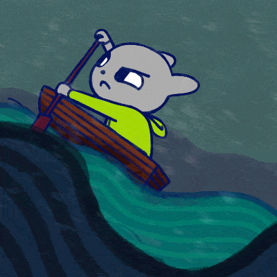

<h1 align="center">
Hi, I'm Muhammet Burak Golec
  </h1>
<br/>

<a href="https://www.youtube.com/watch?v=dQw4w9WgXcQ"></a>

[](https://git.io/typing-svg)

```Go
package life

import "work"

const Target = "DevSecOps"

func main() {
    work("init 5")
    work("Never Give Up")
    work.wait("Success")
}
```

<br>


<div align=center>
        
    </div> 

<div align="center">
  <a href="https://www.buymeacoffee.com/burakgolec" target="_blank">
    
  </a>
</div>

<br>


## My Statistics

<br/>
<p align="left">
  <a href="https://github.com/MuhammetBurakGolec">
  
    
  </a>
</p>
<br>
<br>
<p align="center">
  <a href="https://github.com/MuhammetBurakGolec">
  
  </a>
</p>
</br>

<br>

### Talk with me

<p float="left">
<a href="mailto:burakgolec.ofc@gmail.com"></a>
<a href="https://www.linkedin.com/in/muhammet-burak-g%C3%B6le%C3%A7-71b2871b7/"></a>
</p>

<h1 align="center">Anfall är bästa försvar.</h1>
