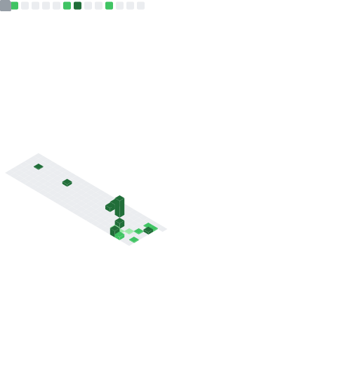

<h1 align="center">
  Hi there, I'm Muhammet Burak Golec 👋
</h1>

<h3 align="center">Computer Engineer | Cloud, Platform & DevSecOps</h3>

  

  

 

## 🌟 About Me
- 💻 I am a **Computer Engineer** passionate about building scalable and secure systems.
- ☁️ My main focus areas are **Cloud Computing, Platform Engineering, DevOps, and Security (DevSecOps)**.
- 🎯 **Mentality**: I approach distributed systems with a **problem and result-oriented** mindset. Instead of just using tools like Kubernetes mechanically, my primary focus is always: *"What exact problem does this solve, and what real value does it provide?"*

---

## 🛠️ Tech Stack & Tools

  <!-- Frameworks -->
  
  
  
   
  <!-- Cloud & DevOps -->
  
  
  
  
  
  
  
  
   
  <!-- Observability & Messaging -->
  
  
  
   
  <!-- Databases & Caching -->
  
  

---

## 🏆 GitHub Profile Trophies

  

---

## 📈 Activity & Metrics

  

  
<b>🔥 Advanced Metrics (Click to Expand)</b>

   
  

    <!-- Notice: Metrics SVG will be generated by the metrics.yml Github Action into the repo -->
    
  

---

## 🌆 3D Contribution Grid

  <!-- Notice: 3D Contrib SVGs will be generated by 3d-contrib.yml into the profile-3d-contrib folder -->
  

---

## 🌟 My GitHub Contributions
 

  <picture>
    <source media="(prefers-color-scheme: dark)" srcset="https://raw.githubusercontent.com/MuhammetBurakGolec/MuhammetBurakGolec/output/github-contribution-grid-snake-dark.svg">
    <source media="(prefers-color-scheme: light)" srcset="https://raw.githubusercontent.com/MuhammetBurakGolec/MuhammetBurakGolec/output/github-contribution-grid-snake.svg">
    
  </picture>

---

## 📊 My GitHub Stats

  

  

---

## 📬 Connect with Me

  
  

---

📖 **Documentation:** Read my architectural approach, best practices, and detailed profile notes in the [docs/README.md](./docs/README.md).
